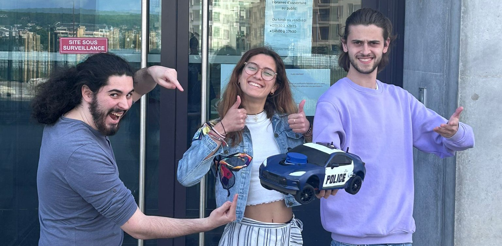

# Abstract
This repository present you a package running with ROS noetic. It is used for [Autonomous car competition](https://ajuton-ens.github.io/CourseVoituresAutonomesSaclay/) organized by Paris Saclay.  
This is an academic project for the authors[^1] during their 2nd year of [mecatronic in ISTY](https://www.isty.uvsq.fr/cycle-ingenieur-mecatronique)[^2].

    

# Wiki
Find explanations about installation and usage in our [Wiki](https://github.com/BlueWan14/auto_car_ctrl/wiki).

# Improuvements to make
In the [issue tab](https://github.com/BlueWan14/auto_car_ctrl/issues) you can find every enhancement that we[^1] think interesting to work on.  
Feel free to continue this project.

[^1]: Pardie MOSKOFIAN, Mateo GELIN and Erwan MAWART
[^2]: *Institue des Sciences et Techniques des Yvelines*
